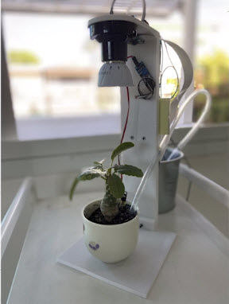
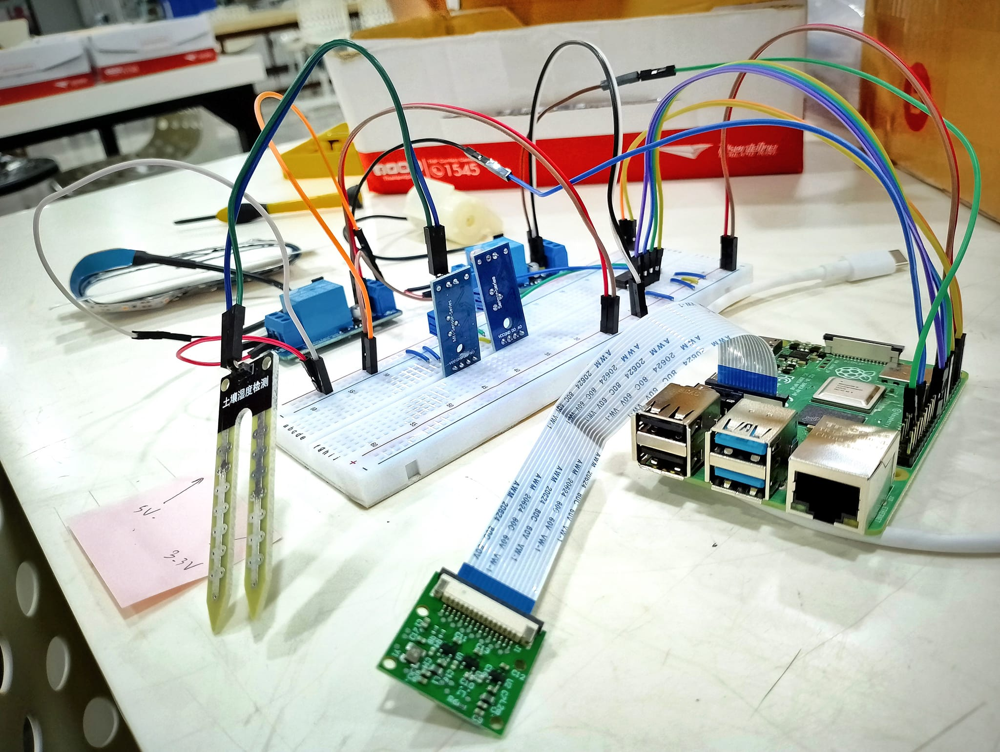
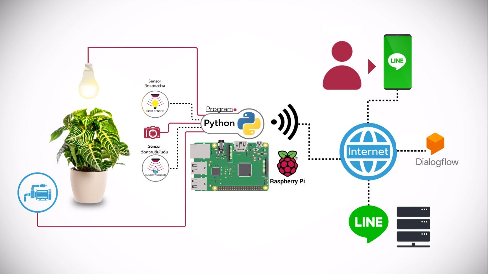

# IOT Robot Gardener
In this IoT internet of things project, I have shown how to make the IoT based indoor plant watering system using Raspberry Pi, 
Line application, Dialogflow and a soil moisture sensor. The Raspberry Pi will control the water pump automatically as per the soil moisture level. 
we can control and monitor the moisture and plant from anywhere in the world using LINE chatbot and Dialogflow.
we can turn on the light bulb in the couldy day and we can take picture of our plant using LINE chatbot as well. 

## Connection Diagram

## Components
<ul>
  <li>Raspberry Pi 4B</li>
  <li>Soil Moisture Sensor</li>
  <li>Raspberry Pi Camera Module</li>
</ul>  
